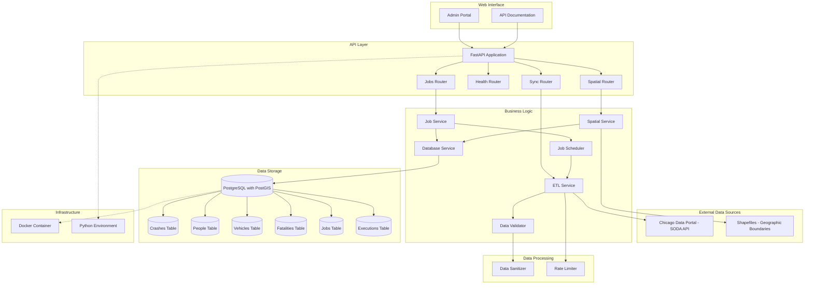

# Chicago Traffic Crash Data Pipeline

[](https://www.python.org/downloads/)
[](LICENSE)
[](https://github.com/astral-sh/ruff)
[](https://github.com/MisterClean/chicago-crashes-pipeline/actions)
[](https://github.com/MisterClean/chicago-crashes-pipeline/actions)
[](https://github.com/MisterClean/chicago-crashes-pipeline/actions)

A Python-based data pipeline that ingests, validates, and serves Chicago traffic crash data from multiple SODA APIs, supporting spatial analysis and automated refresh workflows.

## Overview

The service orchestrates end-to-end ETL for four interconnected datasets from the Chicago Open Data Portal, keeps them synchronized in PostgreSQL/PostGIS, and exposes a FastAPI layer with an admin UI and documentation.

## Quick Start

**Prerequisites**: Python 3.11+, pip, Docker, Node 18+, npm, and GNU Make.

```bash
git clone https://github.com/MisterClean/chicago-crashes-pipeline.git
cd chicago-crashes-pipeline
python -m venv .venv && source .venv/bin/activate
make install
cp .env.example .env  # update credentials as needed
make docker-up  # start Postgres/PostGIS and supporting services
make migrate
make serve  # FastAPI + admin portal at http://localhost:8000
```

## Datasets

1. **Traffic Crashes – Crashes**: Primary crash records (~1M+ rows)
2. **Traffic Crashes – People**: Person-level injury details
3. **Traffic Crashes – Vehicles**: Vehicle and unit information
4. **Traffic Crashes – Vision Zero Fatalities**: Curated fatality data

## Architecture



**Key components**
- **FastAPI service** exposing sync controls, health checks, and spatial endpoints
- **Admin portal** for job orchestration and monitoring
- **Async ETL pipeline** with rate limiting, validation, and sanitization stages
- **Scheduler and job tracking** with retries and execution history
- **PostgreSQL/PostGIS storage** optimised for spatial and analytic workloads

## Highlights

- Automated initial/backfill loads plus incremental syncs with progress tracking
- Batch ingestion (~50k rows per request) using connection pooling and COPY for heavy loads
- Spatial enrichment via PostGIS and shapefile lookups
- Dockerised local stack with reproducible Python environment
- Structured logging and metrics for observability

## Data Quality & Reliability

**Validation & sanitization**
- Geographic bounds, date parsing, age and vehicle year checks
- Duplicate pruning, Unicode handling, and whitespace cleanup

**Resilience**
- Circuit breaker with exponential backoff to respect API limits
- Partial failure recovery to keep ingestion moving
- Detailed error reporting to the job history tables

## API Surface

- `GET /sync/status` – Current sync status and last run time
- `POST /sync/trigger` – Manual sync trigger with optional date range
- `GET /health` – Service health check

## Documentation

Comprehensive documentation is available at http://localhost:8000/documentation/ when running the API server.

**Key Resources:**
- [Quick Start Guide](docs/getting-started/quickstart.md) - Get up and running quickly
- [Configuration Guide](docs/getting-started/configuration.md) - Environment setup
- [API Reference](docs/user-guides/api-reference.md) - Complete API documentation
- [Admin Portal Guide](docs/user-guides/admin-portal.md) - Using the web interface
- [Troubleshooting](docs/operations/troubleshooting.md) - Common issues and solutions
- [Contributing Guidelines](CONTRIBUTING.md) - How to contribute
- [Security Policy](SECURITY.md) - Security best practices and reporting

**Building Documentation:**
```bash
npm install
npm run start  # Dev server at http://localhost:3000
npm run build  # Static build to src/static/documentation/
```

The documentation is built with Docusaurus 3 and includes:
- Architecture diagrams and data flow
- API reference with examples
- Development guides and testing strategies
- Operations and deployment guides
- Data catalog and schema documentation

## Security

We take security seriously. Please review:
- [SECURITY.md](SECURITY.md) - Security policy and vulnerability reporting
- [Security Best Practices](docs/operations/security.md) - Deployment security guide

**Important**: Never use default credentials in production. See the security documentation for configuration guidance.

## Contributing

We welcome contributions! See [CONTRIBUTING.md](CONTRIBUTING.md) for guidelines.

**Quick Start for Contributors:**
1. Fork and clone the repository
2. Set up development environment: `make dev-install`
3. Create a feature branch: `git checkout -b feature/your-feature`
4. Make changes and add tests
5. Run tests and linters: `make test && make lint`
6. Submit a pull request

## Development

```bash
make install        # Install dependencies
make test           # Run tests
make lint           # Lint the codebase
make format         # Apply formatting
make docker-build   # Build Docker images
make migrate        # Run database migrations
```

```
chicago-crash-pipeline/
├── src/
│   ├── api/          # FastAPI service
│   ├── etl/          # ETL pipeline modules
│   ├── models/       # SQLAlchemy models
│   ├── validators/   # Data validation rules
│   ├── spatial/      # Spatial data handlers
│   └── utils/        # Shared helpers
├── migrations/       # Alembic migrations
├── tests/
├── config/
├── docker/
└── docs/
```

## Data Sources

- [Traffic Crashes – Crashes](https://data.cityofchicago.org/Transportation/Traffic-Crashes-Crashes/85ca-t3if)
- [Traffic Crashes – People](https://data.cityofchicago.org/Transportation/Traffic-Crashes-People/u6pd-qa9d)
- [Traffic Crashes – Vehicles](https://data.cityofchicago.org/Transportation/Traffic-Crashes-Vehicles/68nd-jvt3)
- [Vision Zero Fatalities](https://data.cityofchicago.org/Transportation/Traffic-Crashes-Vision-Zero-Chicago-Traffic-Fatali/gzaz-isa6)

## Troubleshooting

**Import errors with relative imports**
- Run Python commands from the repository root so `src` stays on the path
- For ad-hoc scripts, add `sys.path.append("src")`

**Database connection issues**
- Confirm `.env` contains valid credentials
- Verify PostgreSQL/PostGIS is running and the `postgis` extension is enabled

**API rate limits**
- Default configuration respects the 1000 requests/hour cap
- Request a Chicago Data Portal token for higher throughput

**Large data loads**
- Tune the `batch_size` configuration and container memory for initial loads

## License

MIT License - see `LICENSE` for details.
