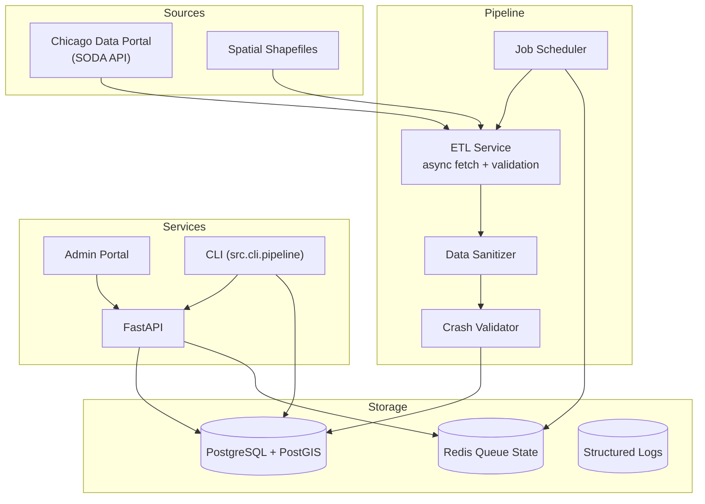

The stack centres around a FastAPI application that exposes health checks, sync controls, job management, and spatial tooling. Batch ingestion jobs run either on demand (via API and CLI) or on a schedule courtesy of an async job scheduler. Data lives in PostgreSQL with PostGIS enabled for spatial analysis.

Key characteristics:

- **Async ETL** with rate limiting and batch orchestration for four official Chicago crash datasets.
- **Admin portal** served as static assets (`src/static/admin`) mounted at `/admin` for operational visibility.
- **Job system** storing schedules and execution history in the database (`src/models/jobs.py`).
- **Spatial pipeline** supporting shapefile ingestion and GeoJSON layer management.
- **Observability** through structured logging, health checks, and Prometheus-friendly metrics hooks.
